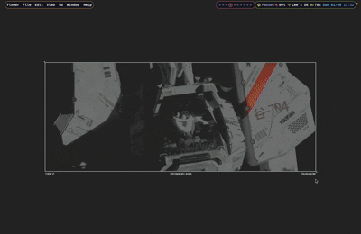

# CURA

[](#)
[](#)

Customizable utility for rapid access, a quick MacOS utility to integrate shell scripts into a GUI selection tool

---

<!--prettier-ignore-start-->

<!--toc:start-->
- [CURA](#cura)
  - [Features (also my todo list)](#features-also-my-todo-list)
  - [Installation](#installation)
    - [Clone this repository](#clone-this-repository)
    - [Build the project](#build-the-project)
    - [Add cura to path (optional)](#add-cura-to-path-optional)
  - [Usage](#usage)
    - [Command Line Interface](#command-line-interface)
    - [Config and Layouts](#config-and-layouts)
    - [Examples](#examples)
      - [App launcher](#app-launcher)
      - [Wallpaper](#wallpaper)
  - [Configurations](#configurations)
    - [Config](#config)
      - [Default config](#default-config)
      - [Top-level configuration](#top-level-configuration)
      - [[keymaps] table](#keymaps-table)
        - [Valid functionality string](#valid-functionality-string)
        - [Example keymaps table](#example-keymaps-table)
    - [Layout](#layout)
      - [Default layout](#default-layout)
      - [Valid Components](#valid-components)
        - [Container](#container)
        - [Input](#input)
        - [List](#list)
        - [List components](#list-components)
          - [Text](#text)
          - [Image](#image)
          - [File](#file)
          - [Object](#object)
          - [More coming soon](#more-coming-soon)
  - [Delimiter](#delimiter)
<!--toc:end-->

<!--prettier-ignore-end-->

## Features (also my todo list)

- [x] Reads a list of items from stdin.
- [x] Displays a customizable GUI using a config and layout.
- [x] Fuzzy-search.
- [x] Sends results to stdout.
- [ ] Add configuration to output section of data (delimited)
- [ ] Fuzzy search content of files instead of filename

## Installation

### Clone this repository

```
git clone https://github.com/shingchunglee/cura.git
```

### Build the project

```
npm install
npm run tauri build
```

Next add the app to your applications folder

### Add cura to path (optional)

```
export PATH="$PATH:/Applications/cura.app/Contents/MacOS"
```

## Usage

### Command Line Interface

```
usage: cura [-h] [-c CONFIG_PATH] [-l LAYOUT_PATH] [-d DELIMITER] [INPUT]

Customizable utility for rapid access and GUI-based selection.

positional arguments: INPUT Input data for GUI selection, provided via stdin [default: none, expects piped input]

optional arguments:
  -h,             --help                  Show this help message and exit
  -c CONFIG_PATH, --config CONFIG_PATH    Specify the path to the theme configuration file (e.g., "/path/to/theme.conf") [default: none]
  -l LAYOUT_PATH, --layout LAYOUT_PATH    Specify the path to the layout configuration file (e.g., "/path/to/layout.conf") [default: none]
  -d DELIMITER,   --delimiter DELIMITER   Specify the delimiter for parsing stdin input (e.g., ",", ";", "\t") [default: none, input treated as a single item]
```

### Config and Layouts

You may provide a config and/or layout file.

Config is a TOML file containing behaviours of the app, Layout is a JSON file containing the customized layout of the GUI

See sections [Config](#config) and [Layout](#layout) for the values and defaults of these two files.

### Examples

#### App launcher

```bash
ls /Applications/ /Applications/Utilities/ /System/Applications/ /System/Applications/Utilities/ | \
    grep '\.app$' | \
    sed 's/\.app$//g' | \
    cura  | \
    xargs -I {} open -a "{}.app"
```

#### Wallpaper

See `examples` folder for the config and layout

```bash
find ~/Pictures/wallpapers -type f \( -iname "*.jpg" -o -iname "*.jpeg" -o -iname "*.png" -o -iname "*.gif" -o -iname "*.bmp" -o -iname "*.tiff" \) -exec realpath {} \; |
  awk '{split($0, a, "/"); fname=a[length(a)]; sub(/.[^.]*$/, "", fname); print $0 ", " fname}' |
  /Applications/cura.app/Contents/MacOS/cura -c ~/.config/cura/wallpaper.toml -l ~/.config/cura/layout/wallpaper.json -d , |
  awk -F',' '{print $1}' |
  xargs -I {} osascript -e 'tell application "System Events" to tell every desktop to set picture to "{}"'
```



## Configurations

### Config

Config changes the behaviours of the app, if value is not provided the default will be used.

If a config file is not provided through the cli flag `--config`, the app will check for a config file in `~/.config/cura/config.toml`

#### Default config

```toml
version = "0.0.1"
exit_on_esc = true
width = 400.0
height = 600.0
scroll_speed = 1000
scroll_delay = 100
fuzzy_threshold = 0.25

[keymaps]
```

#### Top-level configuration

| key             | description                            | value   | default |
| --------------- | -------------------------------------- | ------- | ------- |
| version         | Version string                         | string  | "0.0.1" |
| exit_on_esc     | Exit the app on pressing esc           | bool    | true    |
| width           | Width of the window                    | float   | 400.0   |
| height          | Height of the window                   | float   | 600.0   |
| scroll_speed    | Speed of scrolling on cycling (ms)     | integer | 1000    |
| scroll_delay    | Delay before scrolling on cycling (ms) | integer | 100     |
| fuzzy_threshold | Threshold for fuzzy search             | float   | 0.25    |

#### [keymaps] table

The config.toml file includes a [keymap] sub-table where each key is a string representing a key combination (e.g., `/`, `Ctrl+Q`) and each value is a string.

##### Valid functionality string

| value          | description                                      |
| -------------- | ------------------------------------------------ |
| exit           | Quits the application, without selecting a value |
| select         | Selects a value, and quits the application       |
| search         | Focuses the input component                      |
| cycle_next     | Cycle to the next item in the list               |
| cycle_previous | Cycle to the previous item in the list           |

##### Example keymaps table

```toml
[keymaps]
"Ctrl+Q" = "exit"
"/" = "search"
"Shift+J" = "cycle_next"
"Shift+K" = "cycle_previous"
```

### Layout

The layout is a json file that can be provided through the cli flag `--layout`. It contains a tree of components and the styles of properties of each component.

#### Default layout

The default layout is used if no layout is provided

```json
{
  "component": "container",
  "style": {
    "padding": "8px",
    "background": "#eaeaea",
    "overflow": "hidden",
    "height": "100vh"
  },
  "children": [
    {
      "component": "input",
      "placeholder": "Search...",
      "style": {
        "margin-bottom": "8px",
        "background": "#f9f9f9",
        "padding": "8px",
        "z-index": "1"
      }
    },
    {
      "component": "list",
      "style": {
        "height": "100vh",
        "overflow-y": "auto",
        "border": "1px solid #ccc",
        "border-radius": "4px",
        "background-color": "#fff"
      },
      "children": [
        {
          "component": "container",
          "style": {
            "max-width": "100%",
            "word-warp": "break-word",
            "padding": "8px",
            "background": "#ffffff",
            "margin-bottom": "8px",
            "border-radius": "4px",
            "box-shadow": "0 1px 3px rgba(0,0,0,0.12)"
          },
          "selected_style": {
            "border": "thick double #32a1ce"
          },
          "children": [
            {
              "component": "text",
              "style": {
                "margin-bottom": "4px",
                "font-weight": "bold",
                "word-warp": "break-word"
              }
            }
          ]
        }
      ]
    }
  ]
}
```

#### Valid Components

Shared properties of the components are as follows:

| Name      | Description           | Value          |
| --------- | --------------------- | -------------- |
| component | Name of the component | string         |
| style     | CSS styles            | Key-Value pair |

##### Container

A div, useful for wrapping around children components

| Name     | Description                                   | Value               |
| -------- | --------------------------------------------- | ------------------- |
| children | A list of components within the container div | Array of Components |

##### Input

An input box, used for fuzzing searching

| Name        | Description      | Value  |
| ----------- | ---------------- | ------ |
| placeholder | Placeholder text | string |

##### List

The container for the list of items for selection.

| Name     | Description                                                                                                        | Value               |
| -------- | ------------------------------------------------------------------------------------------------------------------ | ------------------- |
| children | A list of components within the list div, for each selection availiable in stdin, spawn one copy of the components | Array of Components |

##### List components

The following components are meant to be children of a List component, these have the shared properties as follows:

| Name           | Description                                                                                                       | Value          |
| -------------- | ----------------------------------------------------------------------------------------------------------------- | -------------- |
| selected_style | CSS styles, for when the item is being selected                                                                   | Key-Value pair |
| data_index     | The index of the splitted data if a valid delimiter is provided see section [Delimiter](#delimiter) for more info | integer        |

###### Text

A text component displaying the data as a text

###### Image

An image component displaying the data as an image, (treats the data as a file path)

###### File

Displays image files as images, .txt files will have the contents displayed. Otherwise just display the file path.

###### Object

Displays the file path as a HTML external object element see [Object](https://developer.mozilla.org/en-US/docs/Web/HTML/Reference/Elements/object)

###### More coming soon

Got any ideas? Write a feature request!

## Delimiter

Setting a delimiter allows you to split data to be used across various components. A common use case includes splliting the data like so: `<name>, <path to image>`. Then have a text component with data_index=0 and an image component with data_index=1. This example uses `--delimiter=,` to split the data, however you are free to use any character you like to fit your use case.
